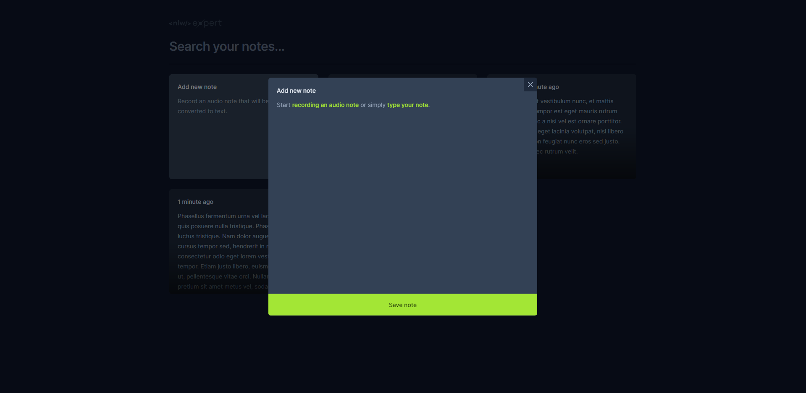

# NLW Expert Notes

A versatile tool for seamless note-taking. Whether you prefer to record your thoughts using voice-to-text transcription or type directly into the app, Expert Notes has you covered. Save and organize your notes securely, and utilize powerful search functionality to find them instantly. Boost your productivity with this intuitive, all-in-one note-taking solution.



## About
This project was developed during NLW, an event at Rocketseat.

### Tech
- TypeScript
- React.js
- TailwindCSS
- Vite
- And more (check my code)

### Features
- Record audio notes and watch them being transcipted into text in real-time.
- Type text notes directly into the app.
- Save and organize your notes.
- Search functionality to find notes instantly.

## Check the project
You can check the project online [clicking here](https://nlw-expert-orpin.vercel.app/)
<br />
OR
<br />
1. Clone the repository

```bash
  git clone https://github.com/brunaporato/nlw-expert.git
```

2. Install dependencies:
```bash
  npm install
```

3. Start the development server:
```bash
  npm run dev
```

## Contribuitions
Contribuitions are welcome. Please feel free to open an issue or a Pull Request.

## Get in touch
If you want to discuss a little further about this or any other project, feel free to contact me.
- [Linkedin](https://linkedin.com/in/brunaporato)
- [Email](mailto:poratodev@gmail.com)
